# Fix ADA CIS In-Module Design Implementation Plan

> **For agentic workers:** REQUIRED SUB-SKILL: Use superpowers:subagent-driven-development (recommended) or superpowers:executing-plans to implement this plan task-by-task. Steps use checkbox (`- [ ]`) syntax for tracking.

**Goal:** Add a safe, reusable CIS-assisted fix workflow to `ada-scan` that turns trustworthy scan findings into deduplicated review units, verifies proposed edits in isolation, and writes source only after explicit approval.

**Architecture:** `ada-scan` remains the only package. Its scanner produces a versioned, attributable report; a new trusted subsystem under `src/fix/` owns policy, context access, CIS calls, review state, verification, apply, and rollback. CIS is untrusted advisory output and never receives filesystem, shell, path-selection, approval, or write authority.

**Tech Stack:** Node.js 20 ESM, native `fetch`, Playwright, axe-core, Lighthouse/PSI, Liquid/Vite instrumentation, native `node:test`, a dependency-free loopback browser workbench.

**Status:** The `cis-contract`, scanner-parity resume gate, and `report-v2`
milestones are complete. Evidence is recorded in
`docs/hit-01-r1-parity-evidence.md`; `trusted-controller` is the next milestone.

---

## Supersession and fixed decisions

This document supersedes the stale external plan
`~/.cursor/plans/fix-ada-cis-architecture_d6d9e4b8.plan.md` where it proposes a
sibling `fix-ada` package or terminal-only review.

The following decisions are fixed:

1. All implementation stays inside the reusable `ada-scan` package.
2. URL-only mode is scan-only.
3. Local-only mode supports scan and reviewed fixes.
4. URL plus local source supports reviewed fixes only after build revision and
   instrumentation digest attestation match; otherwise it fails closed to scan-only.
5. Browser review is required for CIS fixes. The existing wildcard-CORS UI is not a
   production foundation.
6. Opening or accepting a proposed patch records a review decision only. Source writes
   happen through a separate verified Apply action.
7. Accessibility review is file-first. Performance review is metric/opportunity-first.
   Both feed one accepted patch queue and one release gate.
8. A root cause appears once in the workbench. Evidence from axe, accessScan, Nu,
   Lighthouse, routes, and DOM snapshots is merged into that canonical fix unit.
9. CIS cannot read arbitrary files, choose paths, run commands, apply edits, or decide
   whether a patch is safe.
10. The tool reports automated detector closure and required manual checks; it never
    claims complete WCAG conformance.

## Why scanner parity comes first

The Hitachi HIT-01 R1 comparison exposed producer defects that would contaminate every
later CIS decision:

- The module axe layer reported one violation while independent Lighthouse exposed
  `select-name`, `meta-viewport`, and viewport-dependent `button-name` failures.
- accessScan tab rules start from existing tab ARIA roles and can miss a tab-like UI
  whose roles are entirely absent.
- raw Nu output matched R1 at 21 errors and 14 warnings, while normalization inflated it
  to 24 errors and 20 warnings.
- generic `w3c-html-error` rows hide duplicate IDs, nested interactive controls, and
  nested main landmarks.
- Lighthouse category scores are retained, but failed accessibility audit IDs are not
  consistently emitted as actionable findings.

Do not freeze finding identity or train CIS routing around these defects. The scanner
parity phase must first establish which findings are automated, state-dependent,
manual-only, duplicated, or unsupported.

## Target architecture

```mermaid
flowchart LR
  target[URL or local target] --> scanner[ada-scan producer]
  scanner --> report[ScanReportV2]
  report --> canonicalizer[Finding canonicalizer]
  canonicalizer --> modeGate[Mode and revision gate]
  modeGate -->|"URL only / mismatch"| scanOnly[Scan-only report]
  modeGate -->|"Local / attested hybrid"| controller[Trusted local controller]
  controller --> trace[Source Trace inbox]
  trace --> units[Canonical fix units]
  units --> policy[Policy router]
  policy --> deterministic[Pure deterministic proposals]
  policy --> context[Allowlisted context broker]
  context --> cis[CIS advisory inference]
  deterministic --> candidate[Immutable candidate]
  cis --> candidate
  candidate --> shadow[Shadow verification]
  shadow --> review[Secured browser workbench]
  review -->|"Approve exact diff hash"| apply[Transactional apply]
  apply --> rescan[Targeted post-verify]
  rescan --> audit[Append-only audit log]
```



State transitions:

```text
SCANNED
  → CANONICALIZED
  → TRACE_REQUIRED | READY_FOR_POLICY | MANUAL_ONLY
  → CONTEXT_READY
  → PROPOSED
  → SHADOW_VERIFIED | VERIFICATION_FAILED
  → ACCEPTED | REJECTED
  → DIFF_HASH_APPROVED
  → APPLIED
  → POST_VERIFIED | ROLLED_BACK
```

Every transition is local, validated, and append-only in the audit log. CIS can only
cause `CONTEXT_READY → PROPOSED` by returning a locally valid advisory action.

## In-module file layout

```text
ada-scan/
├── bin/ada-scan.js
├── docs/
│   ├── cis-contract.md
│   └── fix-ada-cis-design-plan.md
├── src/
│   ├── index.js
│   ├── schema.js
│   ├── reporter/
│   │   ├── scan-report.js
│   │   ├── report-v2.js
│   │   └── fingerprint.js
│   ├── tracer/
│   │   ├── build-instrumented.js
│   │   ├── partial-map.js
│   │   └── resolve-source.js
│   └── fix/
│       ├── controller/
│       │   ├── index.js
│       │   ├── mode-gate.js
│       │   └── session.js
│       ├── canonical/
│       │   ├── finding-aliases.js
│       │   └── fix-unit.js
│       ├── trace/
│       │   └── inbox.js
│       ├── policy/
│       │   ├── registry.js
│       │   └── router.js
│       ├── context/
│       │   └── broker.js
│       ├── cis/
│       │   ├── limits.js
│       │   ├── transport.js
│       │   ├── parser.js
│       │   └── advisory.js
│       ├── candidate/
│       │   ├── intent.js
│       │   └── diff.js
│       ├── verify/
│       │   └── shadow.js
│       ├── apply/
│       │   ├── transaction.js
│       │   └── rollback.js
│       ├── review/
│       │   ├── server.js
│       │   ├── state.js
│       │   └── workbench.html
│       └── rules/
├── test/
│   ├── fixtures/cis/
│   ├── fixtures/fix/
│   ├── report-v2.test.js
│   └── fix/
└── src/fixer/
    └── ... legacy implementation; no new direct-write behavior
```

The legacy `src/fixer/` code remains available during migration for IDE context modes,
but its CIS transport, direct write paths, wildcard-CORS server, and git-stash rollback
must not be reused in the trusted path.

## Core contracts

### ScanReportV2

The report is immutable input to a fix session:

```js
{
  schemaVersion: '2.0.0',
  reportId: 'sha256:<canonical-report-hash>',
  generatedAt: '2026-07-15T00:00:00.000Z',
  producer: {
    name: 'ada-scan',
    version: '1.1.0',
    nodeVersion: '20.18.1'
  },
  target: {
    mode: 'url-only' | 'local-only' | 'hybrid',
    url: 'https://example.test/',
    buildRevision: 'git-or-export-revision',
    instrumentationDigest: 'sha256:<manifest-hash>'
  },
  scanners: [{
    layer: 'axe',
    engineVersion: '4.12.1',
    viewport: { width: 390, height: 844 },
    state: 'initial',
    status: 'complete'
  }],
  pages: [{
    route: '/',
    findings: []
  }]
}
```

Each finding contains:

```js
{
  findingId: 'sha256:<stable-fingerprint>',
  nativeRuleId: 'select-name',
  canonicalRuleId: 'form-control-accessible-name',
  layer: 'axe',
  category: 'accessibility',
  impact: 'critical',
  pageState: 'initial',
  route: '/',
  element: {
    selector: '#sort-select',
    normalizedHtmlHash: 'sha256:<normalized-dom-hash>'
  },
  source: {
    file: 'src/partials/jobs/sort.liquid',
    line: 12,
    method: 'instrumentation-manifest',
    confidence: 'high',
    preimageSha256: 'sha256:<source-block-hash>'
  },
  evidence: {
    message: 'Select element must have an accessible name',
    rawReference: 'axe:select-name:node-0'
  },
  manualChecks: []
}
```

`findingId` is derived from stable semantic inputs, never UUID or timestamp:

```text
sha256(
  schemaVersion
  + pageState
  + route
  + canonicalRuleId
  + normalized source locator or normalized DOM fingerprint
)
```

Scanner execution details, viewport, and engine version remain separate fields. They
must not make the same unresolved finding appear new on every run.

### Canonical fix unit and deduplication

One UI row represents one root cause:

```js
{
  fixUnitId: 'sha256:<root-cause-hash>',
  kind: 'accessibility' | 'performance',
  title: 'Sort select has no accessible name',
  sourceOwner: {
    file: 'src/partials/jobs/sort.liquid',
    preimageSha256: 'sha256:<source-block-hash>'
  },
  findingIds: ['sha256:...'],
  affectedRoutes: ['/'],
  evidence: [
    { layer: 'axe', nativeRuleId: 'select-name' },
    { layer: 'lighthouse', nativeRuleId: 'select-name' }
  ],
  status: 'trace-required' | 'ready' | 'proposed' | 'verified' |
    'accepted' | 'rejected' | 'applied' | 'manual-only'
}
```

Canonicalization rules:

1. Collapse exact duplicate fingerprints.
2. Merge cross-tool aliases only when canonical rule, source preimage, page state, and
   root-cause region agree.
3. Merge repeated route occurrences into `affectedRoutes` only when they resolve to the
   same source preimage.
4. Preserve every scanner observation inside `evidence`; never delete provenance.
5. Never merge different source hashes, conflicting required edits, or different page
   states.
6. A raw finding ID belongs to exactly one fix unit.
7. Accessibility units group under `sourceOwner.file`.
8. Performance units group by metric/opportunity, route, device, and affected resource
   set; probable owner files are evidence, not forced primary grouping.

### Policy router

Policies replace the current deterministic/AI boolean:

```text
mechanically_safe      → pure local proposal; still reviewed
semantic_assistance    → bounded CIS advisory proposal
manual_only            → evidence and manual procedure; no patch generation
unsupported            → explicit reason; no patch generation
```

A policy decision is versioned and testable:

```js
{
  policyVersion: '1',
  policy: 'semantic_assistance',
  reasonCode: 'VISIBLE_LABEL_SEMANTICS',
  allowedFileTypes: ['.liquid'],
  requiredManualChecks: ['Confirm the visible label is announced once']
}
```

### CIS advisory actions

The request transport must use the Bruno-derived CIS envelope documented in
`docs/cis-contract.md`. PoC `bypass_auth=true` is not production authentication.

CIS returns exactly one locally validated action:

```js
{
  action: 'request_context',
  blockIds: ['ctx_2'],
  reason: 'Need the visible label and select in one block'
}
```

```js
{
  action: 'propose_patch',
  edits: [{
    blockId: 'ctx_1',
    expectedSha256: 'sha256:<supplied-block-hash>',
    oldText: '<select id="sort-select">',
    newText: '<select id="sort-select" aria-label="Sort jobs">'
  }],
  resolvesFindingIds: ['sha256:...'],
  rationale: 'Adds an accessible name without replacing visible text',
  manualChecks: ['Confirm the control is announced as “Sort jobs”']
}
```

```js
{
  action: 'cannot_fix',
  reasonCode: 'AMBIGUOUS_SOURCE',
  explanation: 'Two source blocks contain the same preimage'
}
```

The context broker maps opaque `blockId` values to allowlisted real paths. Paths are
never supplied by or exposed as selectable tools to the model. Model confidence is
ignored.

### Immutable candidate and approval

The controller validates old-text uniqueness, source preimage hashes, overlap, file
type, size, and path safety before rendering a canonical unified diff.

```text
candidateHash = sha256(
  canonical JSON of reportId
  + policyVersion
  + promptVersion
  + modelId
  + ordered validated edit intents
)
```

Accepting a review records `accepted(candidateHash)`. It does not write source. Apply
requires:

1. the same candidate hash,
2. successful shadow verification,
3. unchanged source preimages,
4. explicit diff-hash approval,
5. no unresolved patch conflicts.

## Browser workbench design

The workbench is desktop-first and has two review models inside one release shell.

### Accessibility mode

```text
Source Trace inbox
  → Liquid file
  → canonical fix unit
  → all source snippets
  → merged scanner evidence
  → CIS/deterministic diff
  → Accept / Reject / Revise
```

### Performance mode

```text
Metric or opportunity
  → affected routes/resources
  → probable owner files
  → multi-file patch plan
  → baseline vs shadow result
  → Accept / Reject / Revise
```

Shared behavior:

- Global search and source/status/severity/type facets persist while navigating.
- Source Trace supports Trace all, candidate partials, confidence, editor deep links,
  manual mapping, and merge into an existing fix unit.
- Accepted, rejected, pending, blocked, and verified filters are always visible.
- Accepted decisions can be undone until Apply starts.
- Batch operations are enabled only for individually shadow-verified candidates with
  no conflicts.
- Essential metadata is at least 12–13px; rule IDs and trace internals use disclosure.
- Narrow screens switch Source/List/Review panes into tabs with a sticky decision bar.
- The review UI exposes why Apply is blocked and the exact verification gate that
  remains.

### Loopback security

`src/fix/review/server.js` must:

- bind to `127.0.0.1` on a random available port,
- generate a cryptographically random session token,
- reject requests without the token and matching Origin,
- omit wildcard CORS,
- enforce JSON content type and bounded request bodies,
- use `Cache-Control: no-store`,
- serve a restrictive Content Security Policy,
- escape all scanner/source/model content before rendering,
- keep review-session files mode `0600`,
- reject state transitions that do not match the server-side state machine.

## Verification and apply model

### Shadow verification

The candidate is applied only inside a disposable workspace. The configured workflow is:

```text
validate edit intents
→ copy project metadata and touched files into shadow workspace
→ apply candidate
→ parse/format touched files
→ run project build
→ start shadow site
→ scan affected routes and layers
→ compare target and regression fingerprints
```

Verification succeeds only when:

- the target fingerprints disappear,
- no new critical or serious finding is introduced,
- the build succeeds,
- source tracing still resolves,
- required manual checks remain explicitly pending or are acknowledged by a reviewer.

Performance candidates additionally store baseline/after metrics and environment
metadata. A local Lighthouse run must not be labelled as PSI parity.

### Transactional apply

Apply uses:

- a workspace lock,
- realpath and extension allowlists,
- compare-and-swap preimage hashes,
- byte snapshots of touched files,
- temporary files plus atomic rename,
- an append-only transaction journal.

Rollback restores a file only when its current hash still matches the hash written by
the failed transaction. It must never reset unrelated work or use whole-tree git stash.

## Milestone status

| Milestone | Status | Result |
| --- | --- | --- |
| `cis-contract` | Completed | Redacted Bruno-derived fixtures, limits, provenance, and redaction tests |
| CIS review demo | Completed prototype | File-first review direction validated; no production source writes |
| Scanner parity gate | Completed | HIT-01 R1 findings classified; scanner metadata and regression evidence recorded |
| `report-v2` | Completed | V2 is the source of truth with stable IDs, scanner evidence, trace/build attestation, validation, and a temporary V1 projection |
| `trusted-controller` | Pending | New `src/fix/` state machine, mode gate, policies, canonical units |
| `cis-advisory` | Pending | Runtime CIS transport, parser, bounded context loop |
| `verify-apply` | Pending | Shadow verification, diff-hash approval, transaction and rollback |
| `hybrid-eval` | Pending | Build attestation and PoC safety/quality/cost gates |

---

## Task 1: Preserve and continuously verify the CIS contract

**Files:**
- Existing: `docs/cis-contract.md`
- Existing: `src/fix/cis/limits.js`
- Existing: `scripts/cis-characterize.js`
- Existing: `scripts/lib/cis-redaction.js`
- Existing: `test/cis-contract.test.js`
- Existing: `test/cis-redaction.test.js`
- Existing: `test/fixtures/cis/**`

- [x] **Step 1: Freeze Bruno-derived request fixtures and synthetic response fixtures**

The fixtures distinguish `bruno-derived`, `synthetic-inferred`, and
`observed-environment` provenance and contain no feature key or raw source.

- [x] **Step 2: Enforce fail-closed redaction and immutable PoC limits**

`CIS_POC_LIMITS` limits context rounds, generation attempts, concurrency, tokens, calls,
and session wall-clock time.

- [x] **Step 3: Run the milestone tests**

Run:

```bash
pnpm test
```

Expected: all `cis-contract` and `cis-redaction` tests pass; no network call is required.

- [ ] **Step 4: Replace synthetic fixtures only when a live redacted response is captured**

Run:

```bash
node scripts/cis-characterize.js
pnpm test
```

Expected: either a redacted observed response with updated provenance and tests, or an
explicit network/auth limitation artifact. Never infer that structured output or tools
are supported from an unreachable probe.

## Task 2: Publish ScanReportV2 and stable canonical identity

**Files:**
- Create: `src/reporter/fingerprint.js`
- Create: `src/reporter/report-v2.js`
- Modify: `src/schema.js`
- Modify: `src/reporter/scan-report.js`
- Modify: `src/tracer/partial-map.js`
- Modify: `src/tracer/resolve-source.js`
- Modify: `vite/scan-instrumentation.js`
- Modify: `package.json`
- Create: `test/report-v2.test.js`
- Create: `test/fixtures/fix/report-v2.json`

- [x] **Step 1: Write failing stable-fingerprint tests**

```js
import test from 'node:test';
import assert from 'node:assert/strict';
import { stableFindingFingerprint } from '../src/reporter/fingerprint.js';

test('finding identity ignores UUID, timestamp, and scanner order', () => {
  const a = fixtureFinding({ id: 'one', foundAt: '2026-07-15T00:00:00Z' });
  const b = fixtureFinding({ id: 'two', foundAt: '2026-07-16T00:00:00Z' });
  assert.equal(stableFindingFingerprint(a), stableFindingFingerprint(b));
});

test('different source preimages do not collapse', () => {
  const a = fixtureFinding({ source: { preimageSha256: 'sha256:a' } });
  const b = fixtureFinding({ source: { preimageSha256: 'sha256:b' } });
  assert.notEqual(stableFindingFingerprint(a), stableFindingFingerprint(b));
});
```

- [x] **Step 2: Run the test and confirm it fails**

Run:

```bash
node --test test/report-v2.test.js
```

Expected: failure because `src/reporter/fingerprint.js` does not exist.

- [x] **Step 3: Implement canonical hashing and V2 report validation**

Use `node:crypto`, sorted object keys, normalized whitespace, normalized selectors, and
POSIX relative source paths. Reject missing `schemaVersion`, producer version, target
mode, scanner metadata, finding ID, native/canonical rule IDs, or source confidence.

- [x] **Step 4: Preserve tracing method, confidence, preimage hash, revision, and route dependencies**

The tracer must return explicit `method` and `confidence`; reporters must never replace
them with a generic `low` default when better evidence exists.

- [x] **Step 5: Emit V2 plus a temporary V1 compatibility projection**

`writeReport()` writes V2 as the source of truth. Legacy HTML and IDE modes receive a
projection during migration; they must not mutate V2.

- [x] **Step 6: Verify deterministic report output**

Run:

```bash
node --test test/report-v2.test.js
pnpm test
```

Expected: identical input fixtures produce identical finding IDs and report IDs; all
existing tests pass.

Completed on 2026-07-15. `pnpm test` passes 111 tests; the public
`ada-scan/report` export and declarations resolve; a real local scan writes V2,
and `--report-only` regenerates the legacy HTML/ROI projection without mutating V2.
When the host Vite plugin is absent, the report records
`instrumentationDigest: null` and downgrades path-derived traces instead of claiming
attested source ownership.

## Task 3: Build the trusted controller, mode gate, canonical units, and Source Trace

**Files:**
- Create: `src/fix/controller/index.js`
- Create: `src/fix/controller/mode-gate.js`
- Create: `src/fix/controller/session.js`
- Create: `src/fix/canonical/finding-aliases.js`
- Create: `src/fix/canonical/fix-unit.js`
- Create: `src/fix/trace/inbox.js`
- Create: `src/fix/policy/registry.js`
- Create: `src/fix/policy/router.js`
- Modify: `src/index.js`
- Modify: `bin/ada-scan.js`
- Create: `test/fix/mode-gate.test.js`
- Create: `test/fix/fix-unit.test.js`
- Create: `test/fix/source-trace.test.js`

- [ ] **Step 1: Write failing mode-gate tests**

```js
test('URL-only is always scan-only', () => {
  assert.deepEqual(resolveFixCapability({ url: 'https://example.test' }), {
    mode: 'url-only',
    canFix: false,
    reason: 'LOCAL_SOURCE_REQUIRED',
  });
});

test('hybrid mismatch fails closed', () => {
  const result = resolveFixCapability({
    url: 'https://example.test',
    localRoot: '/repo',
    remoteRevision: 'a',
    localRevision: 'b',
  });
  assert.equal(result.canFix, false);
  assert.equal(result.reason, 'BUILD_REVISION_MISMATCH');
});
```

- [ ] **Step 2: Write failing no-duplicate fix-unit tests**

```js
test('axe and Lighthouse evidence for one source defect become one unit', () => {
  const units = buildFixUnits([axeSelectName, lighthouseSelectName]);
  assert.equal(units.length, 1);
  assert.deepEqual(
    units[0].evidence.map((item) => item.layer).sort(),
    ['axe', 'lighthouse'],
  );
});

test('every finding belongs to exactly one unit', () => {
  const units = buildFixUnits(allFindings);
  const ids = units.flatMap((unit) => unit.findingIds);
  assert.equal(ids.length, new Set(ids).size);
});
```

- [ ] **Step 3: Implement the controller state machine and four policy classes**

Invalid transitions throw typed local errors. `manual_only` and `unsupported` never
reach deterministic or CIS proposal generation.

- [ ] **Step 4: Implement the Source Trace inbox**

Support bulk tracing, candidate partials, confidence, manual file/line mapping, editor
deep links, and merging evidence into an existing canonical unit. Persist manual mapping
as an audit event bound to report and source hashes.

- [ ] **Step 5: Route the CLI through the mode gate**

Supported commands:

```bash
ada-scan --fix --fix-mode cis --ui
ada-scan --url https://example.test --source /absolute/local/root --fix --fix-mode cis --ui
ada-scan fix --report scan-reports/latest.json --ui
```

`ada-scan --url ... --fix` without `--source` prints a scan-only reason and never imports
the fix controller.

- [ ] **Step 6: Run controller and canonicalization tests**

Run:

```bash
node --test test/fix/mode-gate.test.js test/fix/fix-unit.test.js test/fix/source-trace.test.js
pnpm test
```

Expected: URL-only and revision mismatch are rejected; each finding belongs to exactly
one unit; all existing tests pass.

## Task 4: Integrate bounded CIS advisory inference

**Files:**
- Create: `src/fix/context/broker.js`
- Create: `src/fix/cis/transport.js`
- Create: `src/fix/cis/parser.js`
- Create: `src/fix/cis/advisory.js`
- Create: `test/fix/context-broker.test.js`
- Create: `test/fix/cis-parser.test.js`
- Create: `test/fix/cis-advisory.test.js`
- Create: `test/fixtures/fix/prompt-injection.json`
- Modify: `test/cis-contract.test.js`

- [ ] **Step 1: Write failing context-denial tests**

```js
for (const attemptedPath of [
  '../.env',
  '.git/config',
  '/etc/passwd',
  'src/assets/logo.bin',
  'symlink-outside-root',
]) {
  test(`denies ${attemptedPath}`, async () => {
    await assert.rejects(
      () => broker.readByRequestedPath(attemptedPath),
      /CONTEXT_PATH_DENIED/,
    );
  });
}
```

The production API does not expose `readByRequestedPath`; this test helper proves that
path-based requests are denied before the opaque-block API is used.

- [ ] **Step 2: Write failing discriminated-action parser tests**

Test valid actions plus malformed JSON, unknown actions, duplicate/oversized edits,
unknown block IDs, hash mismatch, raw paths, shell instructions, and extra properties.

- [ ] **Step 3: Implement the Bruno-compatible transport**

Send:

```js
{
  target: { provider, model },
  task: {
    type: 'openai-chat-completion-v1',
    input: { messages, max_completion_tokens },
  },
}
```

Use an internal-host allowlist, explicit timeout, transient feature-key access, redacted
errors, and the existing PoC limits. Do not log messages, source, HTML, credentials, or
model output.

- [ ] **Step 4: Implement the bounded advisory loop**

Allow at most the configured context rounds and generation attempts. One invalid-JSON
repair attempt may be used only when limits allow it. Exhaustion yields `cannot_fix`;
it never falls back to unvalidated text patches.

- [ ] **Step 5: Verify injection and exfiltration defenses**

Run:

```bash
node --test test/fix/context-broker.test.js test/fix/cis-parser.test.js test/fix/cis-advisory.test.js
pnpm test
```

Expected: traversal, symlink escape, secret access, arbitrary path requests, unknown
actions, and injection-directed exfiltration all fail closed.

## Task 5: Build the secured file-first and performance-aware review workbench

**Files:**
- Create: `src/fix/review/server.js`
- Create: `src/fix/review/state.js`
- Create: `src/fix/review/workbench.html`
- Create: `test/fix/review-server.test.js`
- Create: `test/fix/review-state.test.js`
- Modify: `src/fix/controller/index.js`

- [ ] **Step 1: Write failing authorization and state-transition tests**

```js
test('rejects mutation without session token and matching origin', async () => {
  const response = await fetch(`${server.url}/api/fix-units/u1/decision`, {
    method: 'POST',
    headers: { 'content-type': 'application/json' },
    body: JSON.stringify({ decision: 'accepted' }),
  });
  assert.equal(response.status, 403);
});

test('accept records a decision but does not write source', async () => {
  await state.accept('unit-1', candidateHash);
  assert.equal(state.get('unit-1').decision, 'accepted');
  assert.equal(await readFile(sourcePath, 'utf8'), originalSource);
});
```

- [ ] **Step 2: Implement the secured loopback server**

Bind only to `127.0.0.1`, issue a random token, validate Origin and token, cap bodies,
escape rendered data, use no-store and CSP headers, and expose only explicit state
transitions.

- [ ] **Step 3: Implement accessibility and performance review models**

Accessibility navigation is file → canonical unit → snippets/evidence/diff. Performance
navigation is opportunity → routes/resources → owner candidates → multi-file plan and
baseline/after.

- [ ] **Step 4: Implement durable review decisions**

Persist accepted/rejected/pending state under
`scan-reports/fix-sessions/<session-id>/session.json` with mode `0600`. Support undo,
status filters, global search, source tracing, and editor deep links.

- [ ] **Step 5: Verify keyboard, zoom, focus, and narrow-screen behavior**

Every action is keyboard-operable, focus remains visible, live status changes are
announced, no content is hidden at 200% zoom, and narrow screens use three explicit
tabs with a sticky decision bar.

- [ ] **Step 6: Run review tests**

Run:

```bash
node --test test/fix/review-server.test.js test/fix/review-state.test.js
pnpm test
```

Expected: unauthorized mutations fail; Accept never writes source; duplicate finding
rows cannot be created; state survives server restart.

## Task 6: Add shadow verification, diff-hash approval, transactional apply, and rollback

**Files:**
- Create: `src/fix/candidate/intent.js`
- Create: `src/fix/candidate/diff.js`
- Create: `src/fix/verify/shadow.js`
- Create: `src/fix/apply/transaction.js`
- Create: `src/fix/apply/rollback.js`
- Create: `test/fix/candidate.test.js`
- Create: `test/fix/shadow.test.js`
- Create: `test/fix/transaction.test.js`
- Create: `test/fixtures/fix/projects/minimal-liquid-site/**`

- [ ] **Step 1: Write failing candidate integrity tests**

Reject stale preimages, non-unique old text, overlapping edits, edits outside allowlisted
extensions, path traversal, symlink escape, and candidate hash changes after review.

- [ ] **Step 2: Write failing transaction and rollback tests**

```js
test('forced second-file failure restores only transaction-owned bytes', async () => {
  const result = await applyTransaction(candidate, { failAfterWrite: 1 });
  assert.equal(result.status, 'rolled-back');
  assert.equal(await bytes(fileA), originalA);
  assert.equal(await bytes(fileB), originalB);
});

test('concurrent user edit blocks apply without overwriting it', async () => {
  await writeFile(fileA, userEditedContent);
  await assert.rejects(() => applyTransaction(candidate), /STALE_PREIMAGE/);
  assert.equal(await readFile(fileA, 'utf8'), userEditedContent);
});
```

- [ ] **Step 3: Implement canonical diff and shadow verification**

Apply edit intents in a disposable workspace, run configured format/build commands,
start the candidate site, and rescan affected routes and layers. Persist detector delta,
build logs, environment metadata, and manual-check flags without standard-log source
content.

- [ ] **Step 4: Require exact diff-hash approval**

The workbench enables Apply only for the verified candidate hash currently displayed.
Any revision, re-fix, source change, or verification rerun invalidates approval.

- [ ] **Step 5: Implement transactional apply and byte-exact rollback**

Use a lock, compare-and-swap hashes, snapshots, temporary files, atomic rename, and a
journal. Never call legacy `src/fixer/rollback.js`.

- [ ] **Step 6: Run safety tests**

Run:

```bash
node --test test/fix/candidate.test.js test/fix/shadow.test.js test/fix/transaction.test.js
pnpm test
```

Expected: zero pre-approval workspace writes; stale or concurrent edits fail closed;
forced failures restore exact original bytes.

## Task 7: Add attested hybrid mode and pass PoC gates

**Files:**
- Modify: `vite/scan-instrumentation.js`
- Modify: `src/tracer/build-instrumented.js`
- Modify: `src/fix/controller/mode-gate.js`
- Modify: `src/fix/controller/index.js`
- Create: `test/fix/hybrid-attestation.test.js`
- Create: `test/fix/poc-gates.test.js`
- Modify: `README.md`
- Modify: `CHANGELOG.md`

- [ ] **Step 1: Emit build revision and instrumentation digest**

The local manifest and rendered target expose the same immutable revision and manifest
digest. A missing marker is not equivalent to a match.

- [ ] **Step 2: Write and pass strict hybrid tests**

Cover exact match, missing marker, revision mismatch, digest mismatch, stale source
preimage, ambiguous mapping, and post-deploy URL mismatch.

- [ ] **Step 3: Run the complete PoC safety gate**

Required:

- zero user-workspace writes before explicit Apply,
- 100% rejection of stale revision/path/symlink cases,
- approval bound to the exact candidate hash,
- byte-exact rollback in forced failures,
- URL-only and unattested hybrid always scan-only,
- no credentials, raw source, HTML, or model output in standard logs.

- [ ] **Step 4: Run the quality gate**

Required:

- at least 99% source-binding precision, with ambiguity failing closed,
- accepted candidates build successfully,
- at least 90% target detector closure on the benchmark corpus,
- zero new critical or serious findings,
- semantic candidates retain explicit human accessibility checks,
- one canonical fix unit per root cause with no repeated UI row.

- [ ] **Step 5: Run the operational gate**

Required:

- p95 no more than two CIS calls per fix unit,
- every state transition has an audit event,
- call/token/latency totals are available without logging sensitive content,
- cancellation and timeout leave no lock or partial workspace write.

- [ ] **Step 6: Document supported commands and migration**

Document URL-only scan, local review, attested hybrid review, session resume, verification,
Apply, rollback, and legacy `src/fixer/` deprecation.

- [ ] **Step 7: Run final verification**

Run:

```bash
pnpm test
pnpm pack --dry-run
```

Expected: all tests pass; the package contains `src/fix/`, the secured workbench,
report-contract files, README, and no fixtures, secrets, local sessions, or scan reports.

## Resume gate after scanner parity work

**Completed 15 July 2026.** See `docs/hit-01-r1-parity-evidence.md` and
`test/fixtures/hit-01-r1-parity.json`.

Before starting Task 2, record evidence that:

1. the benchmark runner preserves tool name/version, viewport, page state, and raw output;
2. axe and Lighthouse accessibility failures are normalized into actionable findings;
3. accessScan can identify missing tab semantics without requiring pre-existing tab roles;
4. Nu raw totals and supplemental findings are separately counted and deduplicated;
5. duplicate IDs, nested interactive elements, and duplicate/nested main landmarks have
   specific canonical rule IDs;
6. PSI failure/fallback provenance is explicit and no local result is compared as PSI;
7. manual-only and state-dependent checks are represented rather than silently omitted;
8. the HIT-01 R1 comparison can explain every baseline finding as detected, equivalent,
   state-dependent, manual-only, unsupported, or a confirmed scanner defect.

Only then should `ScanReportV2` identity and CIS routing semantics be frozen.
